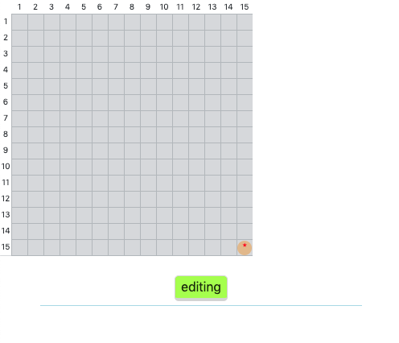
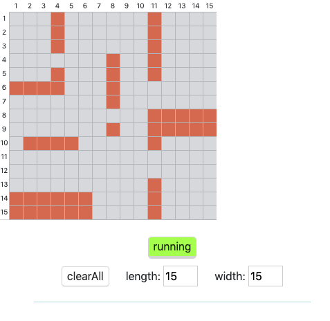
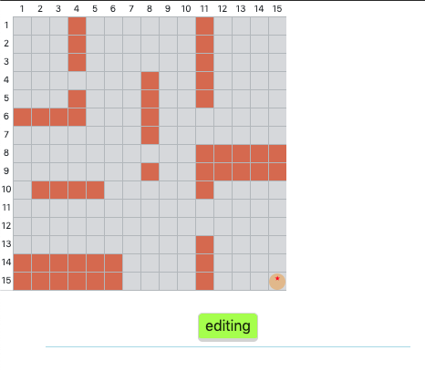
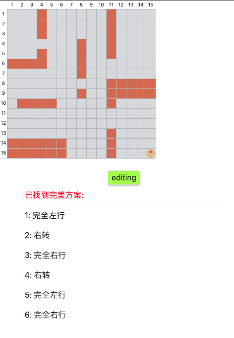
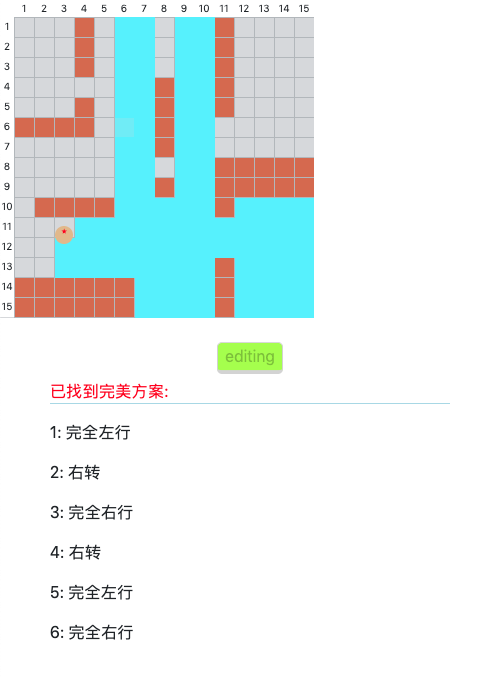

# roomBa-road-navigation
use recursive function to find the best way of cleanning for roomBa

## Use

###  1. Visit the page 
Visit: https://lawliet01.github.io/roomBa-navigation/ \
The page should look like this:\

###  2. Edit the map
Click 'editing' button \
Then click on the gird,the brown block will automatically be added on the grid.\
You can also change the height and width of the map by changing number on the text input.

###  3. Click "running" button to see the roomba again

###  4. Click the roomBa to get the action group

###  5. Click the roomBa again to see how it clean

